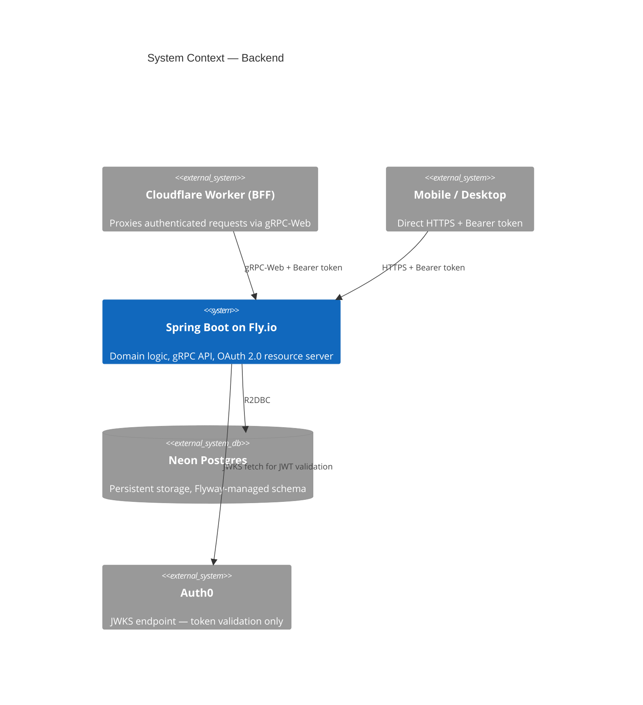
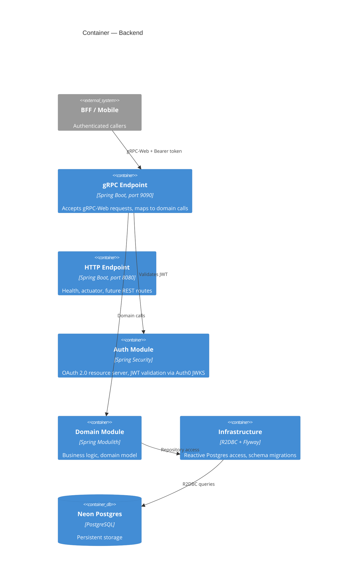

# Template Application — Backend

Spring Boot backend for the template application stack.

## What you get out of the box

- Spring Boot 4 + Spring Modulith — clean module boundaries enforced from day one
- OAuth 2.0 resource server — validates Auth0 JWTs on every protected request
- gRPC-Web endpoint — accepts calls from the BFF (Cloudflare Workers)
- R2DBC + Flyway — reactive database access, schema migrations run automatically on deploy
- Testcontainers integration tests — real Postgres, no mocks, minimal boilerplate
- GitHub Actions CI — build, test, deploy to Fly.io on merge to main
- Dependabot — weekly dependency updates, auto-merged for patch/minor

## Overview

This is the core business logic layer. It receives authenticated requests from two types of client and validates the JWT the same way regardless of origin:

- **From the BFF** — gRPC-Web requests with a Bearer token forwarded by Cloudflare Workers
- **From mobile/desktop clients** — direct HTTPS requests with a Bearer token from Auth0

## Architecture





## Module Structure (Spring Modulith)

Modules live under `com.template` and are enforced at test time — a module can only access another module's public API.

| Module | Package | Responsibility |
|---|---|---|
| `api` | `com.template.api` | gRPC service implementations, request/response mapping |
| `domain` | `com.template.domain` | Business logic, domain model |
| `auth` | `com.template.auth` | Security config, JWT claims extraction |
| `infrastructure` | `com.template.infrastructure` | Database access, external integrations |

Add new domain functionality as a new module under `com.template.<name>`.

## Auth

Spring Boot is configured as an OAuth 2.0 resource server. It validates JWTs against Auth0's JWKS endpoint automatically — no manual key management needed.

```yaml
spring:
  security:
    oauth2:
      resourceserver:
        jwt:
          issuer-uri: ${AUTH0_ISSUER_URI}
          audiences: ${AUTH0_AUDIENCE}
```

Protect endpoints with standard Spring Security annotations:

```java
@PreAuthorize("isAuthenticated()")
@PreAuthorize("hasAuthority('read:data')")
```

Roles and permissions are defined in Auth0 and included in the JWT as a `permissions` claim. Enable **RBAC** and **Add Permissions in the Access Token** in the Auth0 API settings.

## Stack

| Layer | Technology | Version |
|---|---|---|
| Framework | Spring Boot | 4.0.6 |
| Architecture | Spring Modulith | 2.0.6 |
| Language | Java | 25 |
| Build | Maven | (wrapper included) |
| API protocol | gRPC-Web | — |
| Database client | R2DBC (reactive) | via Spring Data R2DBC |
| Migrations | Flyway | 12.5.0 |
| Auth | Auth0 JWT (JWKS) | — |
| Hosting | Fly.io | — |

## Database

The app uses **[Neon](https://neon.tech)** — managed serverless Postgres.

**Two connection strings are required:**

| Variable | Format | Used by |
|---|---|---|
| `DATABASE_URL` | `jdbc:postgresql://...` | Flyway (migrations only) |
| `R2DBC_URL` | `r2dbc:postgresql://...` | Spring Data R2DBC (the app) |

> **Important:** Always use the **direct connection string** (port 5432), not the Neon pooler URL (port 6543). The transaction-mode pooler breaks R2DBC prepared statements.

Flyway migrations live in `src/main/resources/db/migration/` and run automatically on startup.

## Local development

### Prerequisites

- Java 25
- Docker (for Testcontainers integration tests)
- A Postgres instance (local Docker or a Neon dev branch)

### Config

Copy `src/main/resources/application-local.yml.example` to `application-local.yml` (gitignored) and fill in your values:

```yaml
spring:
  datasource:
    url: jdbc:postgresql://localhost:5432/template   # Flyway
  r2dbc:
    url: r2dbc:postgresql://localhost:5432/template  # app

AUTH0_ISSUER_URI: https://your-tenant.auth0.com/
AUTH0_AUDIENCE: https://api.yourproject.com
APP_ENVIRONMENT: local
```

For Neon in dev, use a [Neon branch](https://neon.tech/docs/introduction/branching) per environment and always use the **direct** (non-pooler) connection string.

### Run

```bash
./mvnw spring-boot:run
```

The server starts on port 8080 (HTTP/REST) and 9090 (gRPC).

### Test

```bash
./mvnw test                  # unit tests only (no Docker needed)
./mvnw verify                # unit + integration tests (Docker required)
```

Integration tests use Testcontainers — they spin up a real Postgres automatically. Docker must be running.

## Deployment

Hosted on [Fly.io](https://fly.io).

### First deploy

```bash
fly launch          # creates fly.toml and provisions the app
fly secrets set \
  AUTH0_ISSUER_URI=https://your-tenant.auth0.com/ \
  AUTH0_AUDIENCE=https://api.yourproject.com \
  DATABASE_URL=jdbc:postgresql://... \
  R2DBC_URL=r2dbc:postgresql://...
fly deploy
```

### Subsequent deploys

Push to `main` — GitHub Actions deploys automatically via `flyctl`.

Flyway migrations run as part of the Spring Boot startup on each deploy. If a migration fails, the deploy fails and the old version keeps running.

## Config reference

| Variable | Description |
|---|---|
| `AUTH0_ISSUER_URI` | Auth0 tenant URL, e.g. `https://your-tenant.auth0.com/` |
| `AUTH0_AUDIENCE` | API identifier, e.g. `https://api.yourproject.com` |
| `DATABASE_URL` | Neon direct JDBC URL (port 5432) — used by Flyway |
| `R2DBC_URL` | Neon direct R2DBC URL (port 5432) — used by the app |
| `APP_ENVIRONMENT` | `local`, `production` |

## Part of

See [template-application-planning](https://github.com/neilpmas/template-application-planning) for the full stack overview, architecture decisions, Auth0 setup, and project workflow.
