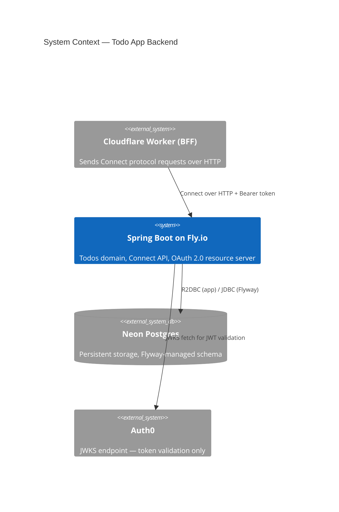
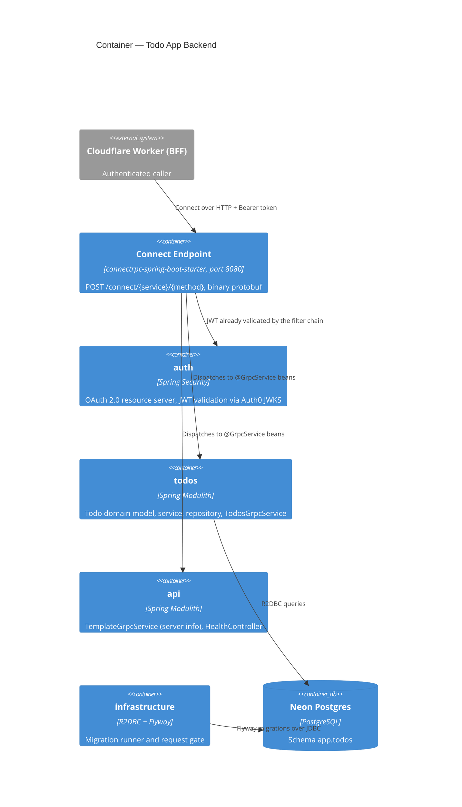

# Todo App — Backend

Spring Boot backend for the Todo App. Owns the todos domain, exposes it over the
[Connect protocol](https://connectrpc.com/docs/protocol/), and validates Auth0 JWTs as an
OAuth 2.0 resource server.

Deployed to [Fly.io](https://fly.io) as `todo-app-backend-neilpmas` (region `syd`). The
frontend and its BFF live in [todo-app-frontend](https://github.com/neilpmas/todo-app-frontend).

## What's in here

- Spring Boot 4 + Spring Modulith — clean module boundaries, enforced by `ModularityTest`
- OAuth 2.0 resource server — validates Auth0 JWTs on every protected request
- Connect protocol endpoint — serves the BFF (Cloudflare Workers) over plain HTTP on port 8080
- R2DBC + Flyway — reactive database access, migrations run after the web server binds
- Testcontainers integration tests — real Postgres, no mocks
- GitHub Actions CI — build and test on every push and PR
- Dependabot — weekly dependency updates, auto-merged for patch/minor

## Overview

This is the core business logic layer. Its only caller in production is the Cloudflare
Workers BFF, which sends **Connect protocol** requests — HTTP POST with a binary protobuf
body — to `/connect/{package.Service}/{Method}` on port 8080, with an Auth0 access token in
an `Authorization: Bearer` header. There are no cookies on this side; the browser session
lives entirely in the BFF.

The Connect endpoint is provided by
[`dev.neilmason:connectrpc-spring-boot-starter`](https://github.com/neilpmas/connectrpc-spring-boot),
which bridges Connect requests onto the `@GrpcService` beans in this repo. It is pure
autoconfiguration — there is no protocol-bridging code in this repo.

> **Why not gRPC?** The BFF runs on Cloudflare Workers (workerd), which does not implement
> `http2.connect`, so it cannot speak native gRPC at all. gRPC-Web is a different wire
> format again, and Spring Boot has no in-process gRPC-Web support without swapping the
> server or adding an Envoy sidecar. Connect over HTTP/1.1 is the format both sides can
> actually speak. See `task-todo-app/specs/connect-endpoint.md` for the full history.

A native gRPC listener (`net.devh:grpc-spring-boot-starter`) still runs on port 9090, but it
is bound to `127.0.0.1`, has its own security disabled, and is **not part of the production
request path**. It exists only for local/in-container debugging.

## Architecture


```mermaid
C4Context
  title System Context — Todo App Backend

  System_Ext(bff, "Cloudflare Worker (BFF)", "Sends Connect protocol requests over HTTP")
  System(backend, "Spring Boot on Fly.io", "Todos domain, Connect API, OAuth 2.0 resource server")
  SystemDb_Ext(db, "Neon Postgres", "Persistent storage, Flyway-managed schema")
  System_Ext(idp, "Auth0", "JWKS endpoint — token validation only")

  Rel(bff, backend, "Connect over HTTP + Bearer token")
  Rel(backend, db, "R2DBC (app) / JDBC (Flyway)")
  Rel(backend, idp, "JWKS fetch for JWT validation")
```


```mermaid
C4Container
  title Container — Todo App Backend

  System_Ext(bff, "Cloudflare Worker (BFF)", "Authenticated caller")

  Container(connect, "Connect Endpoint", "connectrpc-spring-boot-starter, port 8080", "POST /connect/{service}/{method}, binary protobuf")
  Container(auth, "auth", "Spring Security", "OAuth 2.0 resource server, JWT validation via Auth0 JWKS")
  Container(todos, "todos", "Spring Modulith", "Todo domain model, service, repository, TodosGrpcService")
  Container(api, "api", "Spring Modulith", "TemplateGrpcService (server info), HealthController")
  Container(infra, "infrastructure", "R2DBC + Flyway", "Migration runner and request gate")
  ContainerDb(db, "Neon Postgres", "PostgreSQL", "Schema app.todos")

  Rel(bff, connect, "Connect over HTTP + Bearer token")
  Rel(connect, auth, "JWT already validated by the filter chain")
  Rel(connect, todos, "Dispatches to @GrpcService beans")
  Rel(connect, api, "Dispatches to @GrpcService beans")
  Rel(todos, db, "R2DBC queries")
  Rel(infra, db, "Flyway migrations over JDBC")
```

## Module structure (Spring Modulith)

Modules live under `com.template` and are enforced at test time by `ModularityTest` — a
module can only access another module's public API or a `@NamedInterface`.

| Module | Package | Responsibility |
|---|---|---|
| `todos` | `com.template.todos` | Todos domain: `Todo`, `TodoRepository`, `TodoService`, `TodosGrpcService` |
| `api` | `com.template.api` | `TemplateGrpcService` (server version/environment), `HealthController` |
| `auth` | `com.template.auth` | `SecurityConfig` — OAuth 2.0 resource server, path authorization |
| `infrastructure` | `com.template.infrastructure` | `FlywayConfig`, `DatabaseMigrationRunner`, `MigrationGateWebFilter` |

Generated protobuf types live in `com.template.todos.v1` and `com.template.grpc.v1`, each
exposed as a `@NamedInterface("v1")` so other modules can depend on the message types
without depending on the module internals.

> `com.template.domain` exists as an empty placeholder package inherited from the template.
> Real domain logic for this app lives in `todos`.

## API surface

Protobuf definitions are in `src/main/proto/`. Both services are reachable over Connect at
`POST /connect/{package.Service}/{Method}`:

| Service | Proto | Methods |
|---|---|---|
| `todos.v1.TodosService` | `src/main/proto/todos.proto` | `CreateTodo`, `GetTodos`, `CompleteTodo`, `DeleteTodo` |
| `template.v1.TemplateService` | `src/main/proto/template/v1/service.proto` | `GetServerInfo` |

Every `TodosService` method resolves the user from the JWT `sub` claim and scopes the query
to that user — ids from the request payload are never trusted for tenancy.

Two endpoints are unauthenticated: `/actuator/health` and `/health`. Everything else,
including all of `/connect/**`, requires a valid JWT.

### Calling it directly

```bash
# GetTodos takes an empty request, so the protobuf body is zero bytes
curl -X POST http://localhost:8080/connect/todos.v1.TodosService/GetTodos \
  -H "Content-Type: application/proto" \
  -H "Authorization: Bearer <jwt>" \
  --data-binary ''
```

The starter also accepts `Content-Type: application/json` (protobuf-JSON), which is easier
to eyeball while debugging.

### CORS

Disabled: `connect.cors-enabled: false` in `application.yml`. Only the BFF calls this
backend, and it does so server-to-server, so no browser is ever in the request path and
there is nothing for CORS to govern. The starter's default is `true` with a `*` allowlist;
this app deliberately opts out.

## Auth

Spring Boot is configured as an OAuth 2.0 resource server. It validates JWTs against
Auth0's JWKS endpoint automatically — no manual key management.

```yaml
spring:
  security:
    oauth2:
      resourceserver:
        jwt:
          issuer-uri: ${AUTH0_ISSUER_URI}
          audiences: ${AUTH0_AUDIENCE}
```

`AUTH0_ISSUER_URI` must be the full issuer URL including scheme and trailing slash
(`https://your-tenant.auth0.com/`), not a bare hostname.

Service methods read the caller from the reactive security context:

```java
Authentication authentication = SecurityContextHolder.getContext().getAuthentication();
if (authentication != null && authentication.getPrincipal() instanceof Jwt jwt) {
    return jwt.getSubject();
}
```

For finer-grained authorization, standard Spring Security annotations work
(`@PreAuthorize("hasAuthority('read:data')")`). Permissions come from Auth0 in the
`permissions` claim — enable **RBAC** and **Add Permissions in the Access Token** on the
Auth0 API to use them. This app does not currently use them; a valid token for the right
audience is sufficient.

## Stack

| Layer | Technology | Version |
|---|---|---|
| Framework | Spring Boot | 4.1.0 |
| Architecture | Spring Modulith | 2.1.0 |
| Language | Java | 24 |
| Build | Maven | (wrapper included) |
| Web stack | Spring WebFlux (reactive) | — |
| API protocol | Connect (binary protobuf over HTTP) | — |
| Connect bridge | `dev.neilmason:connectrpc-spring-boot-starter` | 0.2.1 |
| gRPC (local only) | `net.devh:grpc-spring-boot-starter` | 3.1.0.RELEASE |
| Database client | R2DBC (reactive) | via Spring Data R2DBC |
| Migrations | Flyway | 13.3.0 |
| Auth | Auth0 JWT (JWKS) | — |
| Hosting | Fly.io | — |

Keep `pom.xml`'s `<java.version>`, `Dockerfile`'s `JAVA_VERSION`, and CI's `java-version` in
lockstep — a mismatch has caused subtle bytecode issues before.

## Database

The app uses **[Neon](https://neon.tech)** — managed serverless Postgres, project region
`ap-southeast-2`. The schema is `app`; the only table today is `app.todos`.

**Two connection strings are required**, because Flyway has no R2DBC driver:

| Variable | Format | Used by |
|---|---|---|
| `DATABASE_URL` | `jdbc:postgresql://...` | Flyway (migrations only) |
| `R2DBC_URL` | `r2dbc:postgresql://...` | Spring Data R2DBC (the app) |

`DATABASE_USERNAME` / `DATABASE_PASSWORD` are applied to both, if credentials aren't already
embedded in the URLs.

> **Important:** Always use the **direct connection string** (port 5432), not the Neon
> pooler URL (port 6543). The transaction-mode pooler breaks R2DBC prepared statements, and
> Flyway needs a direct connection too.

Migrations live in `src/main/resources/db/migration/`.

### How migrations actually run

Not on the default Spring Boot path. Both this app (Fly.io, `min_machines_running = 0`) and
Neon scale to zero, so a cold boot is the normal case and it can be slow. Migrating inside
`ApplicationContext.refresh()` would keep port 8080 closed for the whole of it, which both
fails the request that woke the machine and makes the machine eligible for Fly's
zero-grace-window autostop.

So:

- `FlywayConfig` registers a no-op `FlywayMigrationStrategy`, which takes the work away from
  the autoconfigured `FlywayMigrationInitializer` while keeping all the `spring.flyway.*`
  property binding intact.
- `DatabaseMigrationRunner` is an `ApplicationRunner`, so it calls `flyway.migrate()` *after*
  the reactive web server has bound its port and is answering health checks.
- `MigrationGateWebFilter` parks any `/connect/**` request that arrives mid-migration until
  it completes, rather than letting it hit an unmigrated schema. On failure or timeout
  (`app.migrations.gate-timeout`, default 60s) it returns a retryable Connect `unavailable`
  / HTTP 503. `/health` and `/actuator/health` are deliberately not gated.

`spring.flyway.connect-retries` (10 × 3s) additionally rides out Neon's compute wake-up.

Failure behaviour is unchanged from the stock path: a genuinely broken migration throws from
the runner, the context closes, and the JVM exits non-zero. The app can never be "health
green but unmigrated", because readiness is never published if the runner throws.

## Local development

### Prerequisites

- Java 24
- Docker (for Testcontainers integration tests)
- A Postgres instance (local Docker or a Neon dev branch)

### Config

Either supply the environment variables directly (e.g. an `.env` file and IntelliJ's EnvFile
plugin), or copy `src/main/resources/application-local.yml.example` to
`application-local.yml` (gitignored) and run with the `local` profile:

```yaml
spring:
  datasource:
    url: jdbc:postgresql://localhost:5432/template   # Flyway
  r2dbc:
    url: r2dbc:postgresql://localhost:5432/template  # app

AUTH0_ISSUER_URI: https://your-tenant.auth0.com/
AUTH0_AUDIENCE: https://api.yourproject.com
APP_ENVIRONMENT: local
```

For Neon in dev, use a [Neon branch](https://neon.tech/docs/introduction/branching) per
environment and always use the **direct** (non-pooler) connection string.

See [`task-todo-app/local-dev-guide.md`](https://github.com/neilpmas/task-todo-app) for the
full end-to-end local setup, including the frontend and BFF.

### Run

```bash
./mvnw spring-boot:run
```

The server starts on port 8080 (Connect endpoint, health, actuator) and 9090 (native gRPC,
bound to `127.0.0.1`). Watch for `Started Application` followed by
`Running Flyway migrations (web server already listening)`.

### Test

```bash
./mvnw test                  # unit tests only (no Docker needed)
./mvnw verify                # unit + integration tests (Docker required)
```

Integration tests (`*IT.java`, run by Failsafe) use Testcontainers and spin up a real
Postgres. `AbstractIntegrationTest` runs Flyway itself in `@BeforeAll` against the container
and disables Spring's Flyway autoconfig, so migrations happen exactly once per class.

`ConnectEndpointIT` exercises the real Connect endpoint through the starter's own test
support (`@AutoConfigureConnectTestClient` + `ConnectTestClient`), proving the
autoconfiguration wires up against this app's actual `@GrpcService` beans.

## Deployment

Hosted on [Fly.io](https://fly.io) — app `todo-app-backend-neilpmas`, region `syd`,
`shared-cpu-2x` with 1GB, `min_machines_running = 0`.

> `shared-cpu-1x` is not enough. With no CPU burst balance left after a long idle, Spring's
> own context refresh — which cannot be deferred, since binding Netty is part of it — has
> been observed taking 318s on a cold boot, long enough for Fly's proxy to give up before
> the port was ever bound. On `shared-cpu-2x` the same cold boot took 11.5s.

### First deploy

```bash
fly launch          # creates fly.toml and provisions the app
fly secrets set \
  AUTH0_ISSUER_URI=https://dev-16c3oauv6q5ojze3.us.auth0.com/ \
  AUTH0_AUDIENCE=https://api.todo-app.com \
  DATABASE_URL=jdbc:postgresql://... \
  R2DBC_URL=r2dbc:postgresql://... \
  APP_ENVIRONMENT=production
fly deploy
```

### Subsequent deploys

`fly deploy`, run manually. CI builds and tests every push and PR but does **not** deploy —
tagging a release does not deploy it either.

Flyway migrations run on startup of the new machine, just after the port binds. A failed
migration exits the process non-zero and the deploy fails.

## Config reference

| Variable | Description |
|---|---|
| `AUTH0_ISSUER_URI` | Auth0 tenant URL **with scheme and trailing slash**, e.g. `https://dev-16c3oauv6q5ojze3.us.auth0.com/` |
| `AUTH0_AUDIENCE` | API identifier — `https://api.todo-app.com`. Must match the BFF's `AUTH0_AUDIENCE` |
| `DATABASE_URL` | Neon direct JDBC URL (port 5432) — used by Flyway |
| `R2DBC_URL` | Neon direct R2DBC URL (port 5432) — used by the app |
| `DATABASE_USERNAME` | Optional, if not embedded in the URLs |
| `DATABASE_PASSWORD` | Optional, if not embedded in the URLs |
| `APP_ENVIRONMENT` | `local`, `production` — surfaced by `GetServerInfo` |

Notable `application.yml` keys:

| Key | Value | Why |
|---|---|---|
| `connect.cors-enabled` | `false` | Only the BFF calls this, server-to-server |
| `app.migrations.gate-timeout` | `60s` | How long `MigrationGateWebFilter` parks a request before 503 |
| `spring.flyway.connect-retries` | `10` × `3s` | Rides out Neon's compute wake-up on a cold start |
| `grpc.server.address` | `127.0.0.1` | The native gRPC listener is not externally reachable |
| `grpc.server.security.enabled` | `false` | Safe only because of the loopback bind above |

## Part of

See [template-application-planning](https://github.com/neilpmas/template-application-planning)
for the stack overview and architecture decisions this app was built from, and
`task-todo-app` for this project's own planning notes and session history.
